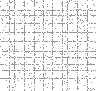

# Kevin's Advent of Code 2020
These are my solutions for [Advent of Code
2020](https://adventofcode.com/2020/).

## About

[AoC](https://adventofcode.com/2020/) is a popular yearly programming challenge
in December. Each night from December 1-25, a new difficult word problem is
released to the world at midnight EST. A challenge could be [following hundreds
of instructions to navigate a ship at sea](12), or [keeping track of one million
labelled cups shuffled ten million times](23). Solving part one of a problem
unlocks a more difficult second part extension of the problem. [Some
problems](20) took me over 5 hours of continuous work to complete. I avoided
looking at hints or clues while making these, and the solutions are truly my
own. Completing one part of a challenge grants you a golden star, and I was able
to earn all 50 after many hours of work and problem-solving. I've included
[some of my statistics below](#my-stats).

Each day required a creative, optimized solution in order to find an answer in a
reasonable time. There are no restrictions on how you choose to solve a problem.
[Python 3](https://www.python.org/) was my tool of choice.

## Art

 

Animations generated from [Day 11](11)

## My Stats

Each day I would try to solve a problem as quickly as possible. Below are some
statistics given by the site on how well I did compared to other users. Everyone
gets access to the problems at the same time (12:00pm EST). Each day has a
`Time` and `Rank` for both part 1 and part 2.

`Time` shows how long it took me to submit a correct solution after a problem's
release. Completing part 1 logs a time and unlocks part 2.

`Rank` A rank of 1,000 would mean I was the 1,000th person to complete that part
of a challenge. A smaller number is better.

Each day could have [anywhere from 10,000 to over 100,000 users submitting
answers](https://adventofcode.com/2020/stats), and I'm satisfied with my
performances. I've included all the data in a table and some aggregate data
below.


```
      ----Part 1----    ----Part 2----
Day       Time  Rank       Time   Rank  

 25   00:19:37  1423   05:07:59   5105
 24   00:22:15  1249   00:47:28   1309
 23   00:47:30  1968       >24h  11024
 22   00:09:52  1059   03:11:45   4095
 21   00:43:58  1777   00:47:58   1424
 20   01:16:05  1801   05:18:06   1561
 19   01:27:58  2552   04:13:11   3089
 18   01:43:05  4634   01:54:37   3606
 17   00:34:47  1402   02:00:06   3918
 16   00:15:50  1280   01:30:48   3256
 15   01:10:49  6162   01:22:33   5138
 14   00:26:58  2467   01:18:30   3282
 13   00:20:49  4479   03:41:06   5069
 12   00:11:06  1004   00:28:35   1437
 11   00:55:57  4828   01:29:44   4497
 10   00:13:22  3736   02:45:43   7487
  9   00:09:27  1934   00:16:24   1554
  8   00:07:57  1475   00:18:22   1377
  7   00:26:46  2018   01:27:52   4915
  6   00:05:45  1479   00:11:27   1513
  5   00:09:32  1116   00:12:32    864
  4   00:26:57  5359       >24h  73891
  3   00:07:21  1435   00:12:00   1341
  2   00:07:21  1461   00:15:15   2114
  1   00:50:59  5530   00:52:35   5010
```

Part   | Median Time | Median Rank  | Fastest Time| Best Rank
-------| ------------| -------------|-------------|----------
Part 1 | 00:22:15   | 1801    | 00:05:45 (day 6)   | 1004 (day 12)
Part 2 | 01:27:52   | 3282    | 00:11:27 (day 6)   | 864 (day 5)

## Running my Code

The programs I came up with are included in this repository organized by day.
You can run them yourself by installing [Python 3](https://www.python.org/) and
executing the `run.py` file contained in a day's folder.

```sh
# example command to run day 20's solution
cd 20
python run.py
```
